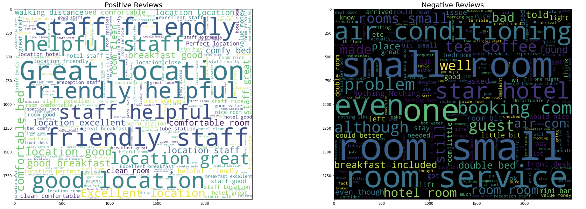

# Hotel-Review-Sentiment-Analysis
In this project, we analyze positive and negative hotel reviews and design a model for inferring positive or negative sentiment given a review. We combine a pretrained BERT lanuguage model and a custom multi-layer perceptron to achieve this.

Word clouds for the respective sentiments:

